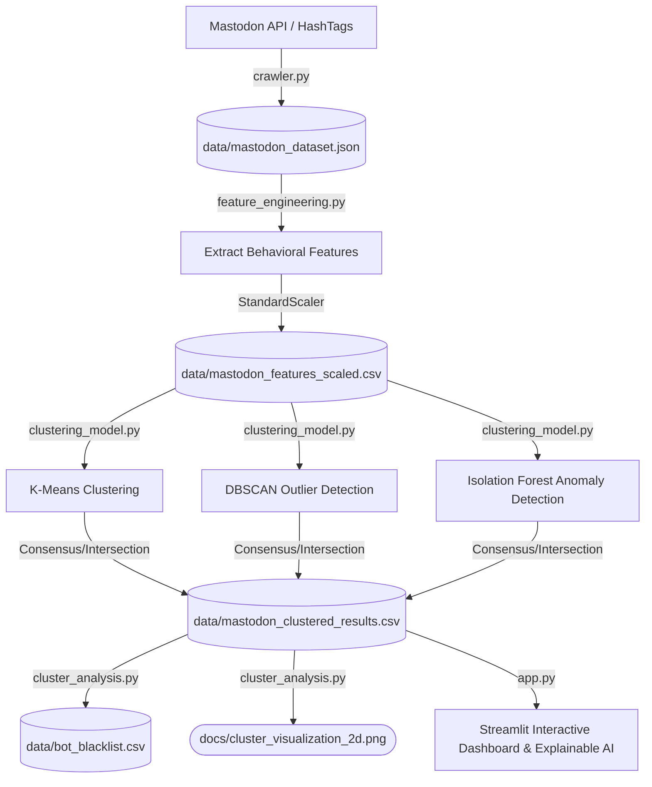

# Mastodon Bot Detection Project Summary

This project implements an unsupervised machine learning pipeline to identify bot and spam accounts on the Mastodon social network. By analyzing user behavior (posting frequency, follow ratios, interaction metrics, and circadian activity), the system classifies accounts using K-Means, DBSCAN, and Isolation Forest algorithms.

---

## 📂 Repository Architecture

The project has been refactored into a logical and modular structure:

```
mastodon/
│
├── run_pipeline.py             # Orchestrates the execution of the full ML pipeline
│
├── src/                        # Python Source Modules
│   ├── setup_app.py            # Mastodon API client registration & user authorization
│   ├── crawler.py              # Social data scraping and extraction
│   ├── feature_engineering.py  # Behavioral vector construction & feature scaling
│   ├── clustering_model.py     # Unsupervised model training, anomaly detection, & ensemble validation
│   ├── cluster_analysis.py     # Dimensionality reduction (PCA), profile analysis, & blacklist generation
│   └── app.py                  # Streamlit Web UI & Explainable AI (XAI) dashboard
│
├── data/                       # Datasets, Model Artifacts & Secrets
│   ├── mastodon_clientcred.secret   # Mastodon Client ID (registered application credentials)
│   ├── mastodon_usercred.secret     # Mastodon User access token
│   ├── mastodon_dataset.json        # Raw crawled profiles and statuses
│   ├── mastodon_features_scaled.csv # Standardized behavioral features
│   ├── mastodon_clustered_results.csv # Labelled cluster results
│   └── bot_blacklist.csv           # Final list of detected bot/spam usernames
│
└── docs/                       # Visualizations & Documentation
    ├── elbow_method.png             # KMeans elbow graph for optimal clusters (K)
    ├── cluster_visualization_2d.png # 2D PCA representation of behavior space
    └── project_summary.md           # Project architecture and technical specification (This File)
```

---

## 🔄 Data Flow Pipeline

The end-to-end processing pipeline runs sequentially as follows:



---

## 🛠️ Pipeline Modules Detail

### 1. Data Scraping (`src/crawler.py` & `src/setup_app.py`)
- **Authentication**: `setup_app.py` registers the application on Mastodon servers (e.g. `mastodon.social`) and requests explicit OAuth authorization to fetch `mastodon_usercred.secret`.
- **Target Collection**: `crawler.py` collects up to 200 distinct user IDs active across popular trending hashtags (e.g., `#news`, `#tech`, `#art`).
- **Profile Scraping**: For each collected user, the system retrieves profile metadata along with their 20 most recent statuses.
- **HTML Sanitization**: Uses `BeautifulSoup` to parse HTML posts and extract clean textual content.
- **Incremental Storing**: Employs incremental save cycles directly to `data/mastodon_dataset.json` to prevent data loss.

### 2. Feature Engineering & Scaling (`src/feature_engineering.py`)
Parses raw timeline events to compile four behavioral feature vectors:
1. **Follow Ratio**: $\text{Following} / (\text{Followers} + 1)$. Heavy bots often follow thousands of profiles but have very few organic followers.
2. **Posting Frequency (Average Inter-post Time)**: Calculates the average time (in minutes) between consecutive statuses. Automated accounts often post with highly structured, short delays.
3. **Average Engagement Rate**: Calculates $\text{Replies} + \text{Reblogs} + \text{Favourites}$ divided by the total posts.
4. **Night Post Ratio**: Proportion of posts created between 1:00 AM and 5:00 AM local time. Circadian sleep cycles are absent in automated bots.

Standardization is applied using `StandardScaler` to bring features onto a matching scale, ensuring K-Means/distance metrics are not dominated by the scale of posting frequency.

### 3. Model Training & Anomaly Detection (`src/clustering_model.py`)
- **Optimal K Estimation**: Computes within-cluster sum of squares (WCSS) via K-Means from $k=2$ to $k=8$ and saves the Elbow curve `docs/elbow_method.png`.
- **K-Means Partitioning**: Standard K-Means grouping ($k=3$) to profile common behavior patterns.
- **Ensemble Bot Discovery**:
  - **DBSCAN**: Detects density-isolated outlier points ($\text{eps}=1.5, \text{min\_samples}=3$) indicating rare, extreme behavior.
  - **Isolation Forest**: Builds recursive isolation trees with a $10\%$ expected anomaly contamination factor to identify abnormal accounts.
  - **Intersection / Consensus Validation**: Evaluates cross-model agreement. Accounts marked as anomalies by BOTH DBSCAN and Isolation Forest are labeled with extremely high confidence.

### 4. Dimensionality Reduction & Analysis (`src/cluster_analysis.py`)
- **Cluster Profiling**: Generates group averages for all features under K-Means to identify what behavioral traits define normal users, active power-users, and automated actors.
- **Principal Component Analysis (PCA)**: Compresses the 4-dimensional normalized vector space into 2 component dimensions (`pca_1`, `pca_2`) and renders a 2D behavior map `docs/cluster_visualization_2d.png`.
- **Target Blacklisting**: Aggregates verified outliers and exports them to `data/bot_blacklist.csv` for enterprise-level ad/audience exclusion.

### 5. Interactive Dashboard & Explainable AI (`src/app.py`)
- **Dashboard Overview**: Displays total scan accounts, anomaly count, bad traffic percentage, and interactive table of blacklist exports.
- **Explainable AI (XAI)**: Allows security staff to search any handle. It displays an instant safety verdict along with a visual side-by-side comparison of the user's standardized scores against the average organic baseline.
